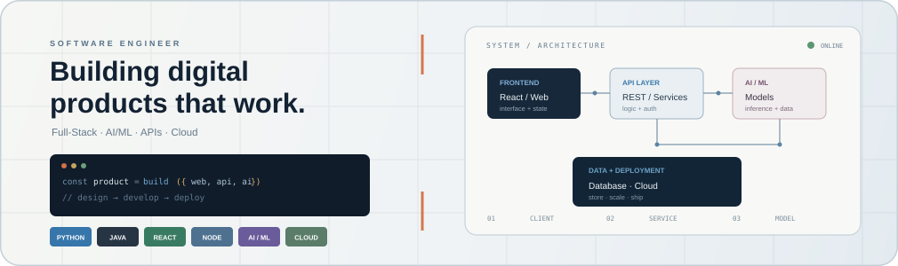

<h1>HARSH KUMAR</h1>

<h3><code>Build • Learn • Ship </code></h3>

 

## the idea

I'm Harsh — a developer who likes turning ideas into working software.

I enjoy building **full-stack applications, AI-powered tools and products that solve practical problems**.

Most of what you'll find here started with a simple question:

> *"What if I built this?"*

---

